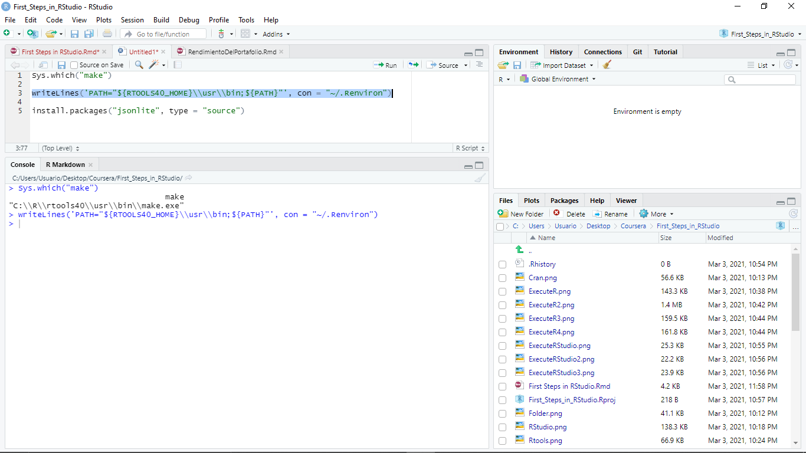

```{r setup, include=FALSE}
knitr::opts_chunk$set(echo = TRUE)
```

### Creating a folder on local disck C

We have to be ordered to download R and RStudio, due to RStudio requires Rtools to compile packages on Windows. We are going to create a folder called **R**. In this folder we are going to save R, RStudio and Rtools.

<div style="text-align: center">

<div/>

### 1.- R, Rstudio and Rtools download
We can save the following files in other folder on the desktop.

We are going to download R 4.0.4 for windows from this link https://cran.r-project.org/bin/windows/base/.

<div style="text-align: center">

\\

After that, from the next link we are going to download RStudio for windows https://rstudio.com/products/rstudio/download/.

<div style="text-align: center">

<div/>

\\

Finally, we are going to download Rtools40 for windows from the next link https://cran.r-project.org/bin/windows/Rtools/. Rtools is from Cran the same as R. We are going to choose the 64-bit version.

<div style="text-align: center">

<div/>

### 2.- R installation

Execute R as an administrador

\\

<div style="text-align: center">

<div/>

\\

Choose a language

\\

<div style="text-align: center">

<div/>

\\

When we arrive at the following screen we have to change the default address by the R folder on local disk. Then, we are going to do the same thing for the other two, RStudio and Rtools.

\\

<div style="text-align: center">

<div/>

\\

<div style="text-align: center">

<div/>

\\

At the end we press the "Finish" button.

Before to continue with the other installations, we have to go to properties on the R-4.0.4 folder located in R folder on local disk C. 

\\

<div style="text-align: center">

<div/>

\\

After the above, we uncheck read only option, click apply then OK.

\\

<div style="text-align: center">

<div/>

\\

<div style="text-align: center">

<div/>

\\

### 3.- RStudio installation

Analogously we execute RStudio as an administrador and change the default address. Finally, we install RStudio.

\\

<div style="text-align: center">

<div/>

<div style="text-align: center">

<div/>

<div style="text-align: center">

<div/>

\\

### 4.- Rtools installation

Execute Rtools as an administrator, change the default address and install.

\\

<div style="text-align: center">

<div/>

<div style="text-align: center">

<div/>

\\

### The last steps to compile R packages

We need to perform one more step to be able to compile R packages. In the link before we downloaded Rtools40 (https://cran.r-project.org/bin/windows/Rtools/) we have an instructions that we going to copy and paste an R Script.

\\

<div style="text-align: center">

<div/>

<div style="text-align: center">

<div/>

\\

By the other hand, we have to go to "Edit the system enviroment variables".

\\

<div style="text-align: center">

<div/>

\\

Go to Enviroment Variables.

\\

<div style="text-align: center">

<div/>

\\

In the next screen click on New and at the name of variable write "RTOOLS40_HOME"
<div style="text-align: center">

<div/>

<div style="text-align: center">

<div/>

\\

Now in the Rtools40 folder located in the R folder on the local disk C, we have to copy the path of the folder and paste it in the variable value, we add a slash.

\\

<div style="text-align: center">

<div/>

<div style="text-align: center">

<div/>

<div style="text-align: center">

<div/>

\\

Click Ok and we repeat the steps for the quadrant above.

\\

<div style="text-align: center">

<div/>

\\

In the first quadrant select the "Path", click Edit then New and write 
%RTOOLS40_HOME% \ usr \ bin \

\\

<div style="text-align: center">

<div/>


<div style="text-align: center">

<div/>

\\

We have repeat the steps for the "Path" in the lower quadrant. At the end click OK.

\\

<div style="text-align: center">

<div/>

\\

For finishing click OK.

\\

<div style="text-align: center">

<div/>

\\

We created a new R Script and copy functions from Cran page for Rtools40. We are goint to execute **Sys.which("make")**.

\\

<div style="text-align: center">

<div/>

\\

We execute **writeLines()** function.

\\

<div style="text-align: center">

<div/>

\\

Finally, we install an R package from source to check if the above works.

\\

<div style="text-align: center">

<div/>

\\

# **Now we are ready to continue learning!**

\\